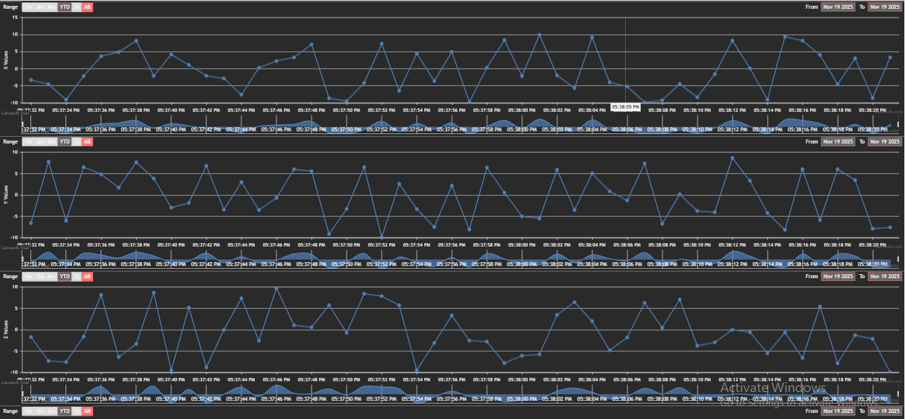
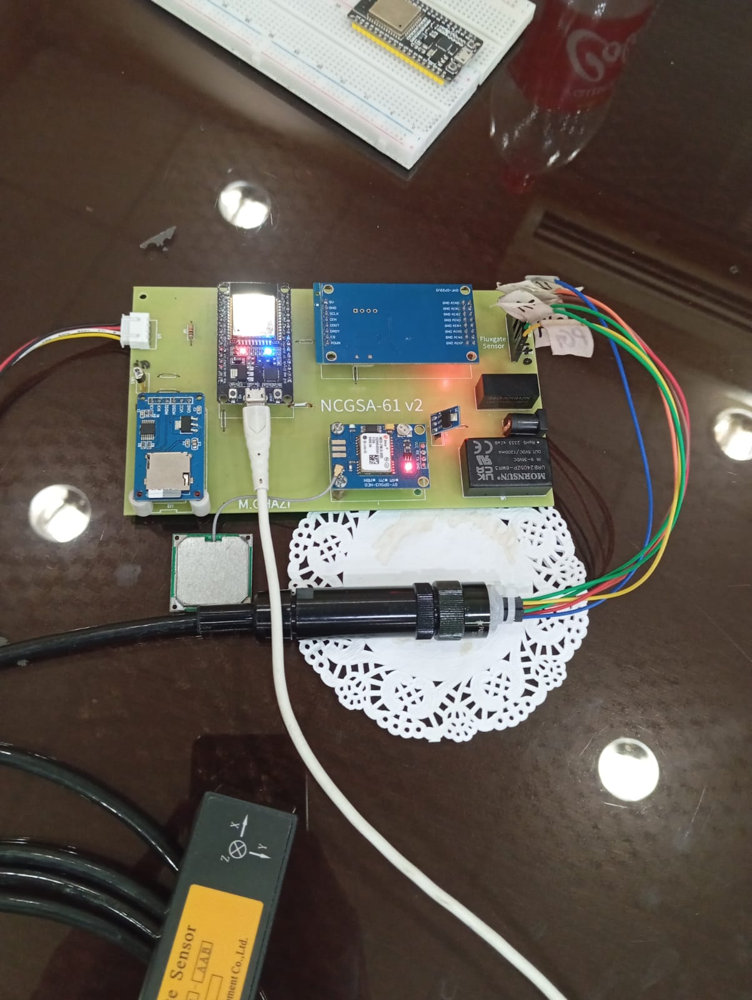
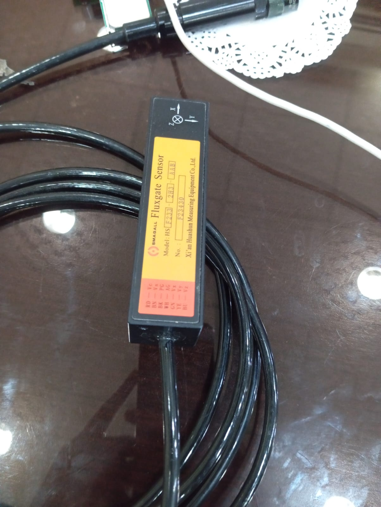
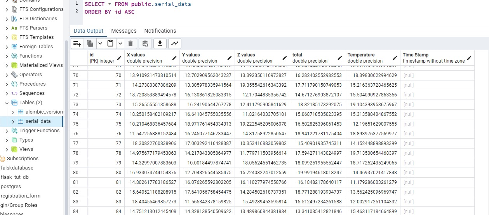

# IoT-Based Motor Monitoring System

## Overview

This project is an **IoT-based motor monitoring system** designed to track motor behavior in real-time. The system uses an **ESP32** microcontroller with a **fluxgate sensor** to monitor motor positions, enabling precise tracking of changes in motor behavior. Additionally, a **DHT11 sensor** is integrated to monitor temperature, and an **SD card module** is used for data storage, providing a reliable and persistent log of all sensor readings.

The system is paired with a **Flask-based web application** that visualizes motor parameters in real-time, making it easier to analyze motor performance and detect anomalies.

---

## Features

- **Motor Position Monitoring:** Tracks motor rotations/positions using a fluxgate sensor.  
- **Environmental Monitoring:** Temperature readings collected via DHT11 sensor.  
- **Data Logging:** Sensor readings are stored on an SD card for offline analysis.  
- **Real-Time Visualization:** Flask web server displays live charts of motor and environmental data.  
- **IoT-Enabled:** ESP32 collects and sends sensor data in real-time to the web application.  

---

## Hardware Components

- ESP32 Microcontroller  
- Fluxgate Sensor (for motor position tracking)  
- DHT11 Temperature and Humidity Sensor  
- SD Card Module for local data storage  
- Motor (as the monitored device)  

---

## Software Components

- **Python 3** with **Flask** for web server and API  
- **JavaScript (CanvasJS)** for real-time chart visualization  
- **Serial Communication** for ESP32 → Flask data transmission  

---

## How It Works

1. **Data Collection:** ESP32 reads motor position data from the fluxgate sensor and temperature from the DHT11 sensor.  
2. **Data Logging:** Sensor readings are stored locally on an SD card.  
3. **Real-Time Transmission:** ESP32 sends sensor data over serial communication to a Flask server.  
4. **Visualization:** Flask server exposes a `/api/get-graph-data` endpoint; JavaScript fetches this data and renders live charts.  

---

## Screenshots

**Monitoring Dashboard:**  

**Circuit Design 1:**  

**Circuit Design 2:**  

**Database:**  

### Potential Improvements

1. Add historical data storage in a database for long-term analysis.
2. Include alerts/notifications for abnormal motor behavior.
3. Integrate multiple motors and sensors for a more advanced monitoring system.
